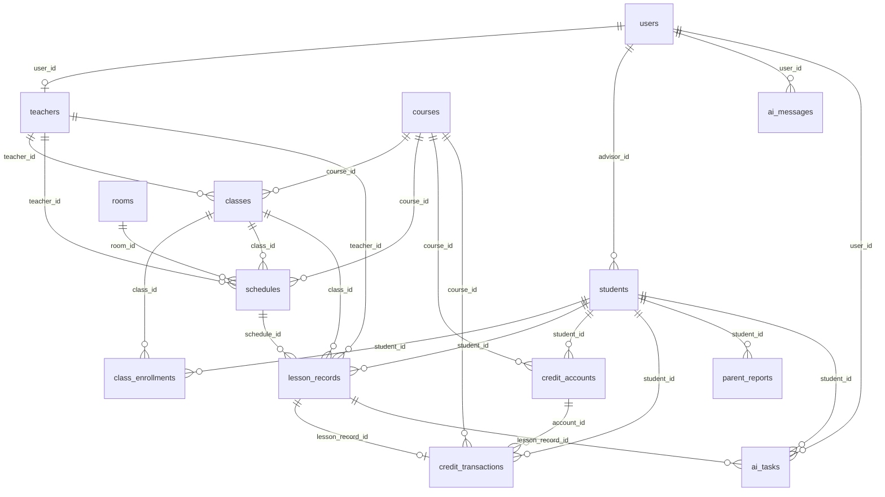

# Astralink 灵枢教务系统 — 后端 MVP 数据模型

> 基于当前前端 `src/types/`、`src/services/` 与 [api-spec.md](./api-spec.md) 设计  
> 目标：支撑第一阶段核心闭环（学员 → 排课 → 上课记录 → 消课 → 课时流水 → 家长报告 → AI 助手）

## 设计原则

1. **主数据规范化**：学员、课程、教师、班级、排课、上课记录以 ID 关联，API 层可返回前端所需的冗余展示字段（如 `studentName`）。
2. **课时账务独立**：`credit_accounts` 维护余额；`credit_transactions` 记录每一笔变动，消课与手动调整均落流水。
3. **时间字段标准化**：排课、上课记录使用 `TIMESTAMPTZ` / `DATE` + `TIME`，前端日历的 `colIndex` / `topIndex` 由 API 计算。
4. **AI 异步化**：AI 反馈、续费建议、报告摘要写入 `ai_tasks`；对话消息写入 `ai_messages`。
5. **家长报告快照**：`parent_reports` 保存某一周期的报告快照，支持后续发送与审计。

**推荐数据库**：PostgreSQL 15+（类型以 PostgreSQL 为基准，其他数据库可做等价映射）

---

## 1. 数据表总览

| # | 表名 | 说明 | 对应前端类型 | 第一阶段必做 |
|---|------|------|--------------|--------------|
| 1 | `users` | 系统用户（管理员、顾问、教师账号） | — | **是** |
| 2 | `students` | 学员主档 | `Student` | **是** |
| 3 | `courses` | 课程产品 | `Course` | **是** |
| 4 | `classes` | 开班/班级 | `Class` | **是** |
| 5 | `teachers` | 教师档案 | `Teacher` | **是** |
| 6 | `schedules` | 排课日历事件 | `Schedule`（规范化存储） | **是** |
| 7 | `lesson_records` | 上课记录与课堂反馈 | `LessonRecord` | **是** |
| 8 | `credit_accounts` | 学员课时账户 | `Student.remainingCredits` | **是** |
| 9 | `credit_transactions` | 课时流水 / 订单 | `CreditTransaction` | **是** |
| 10 | `parent_reports` | 家长报告快照 | `ParentReport` | **是**（可先存静态快照） |
| 11 | `ai_messages` | AI 对话消息 | `AIMessage` / `AIChatHistoryItem` | **是**（基础问答） |
| 12 | `ai_tasks` | AI 异步任务 | `RenewalSuggestion`、反馈摘要等 | **是**（反馈/摘要任务） |

### MVP 辅助表（建议同期创建，体量小）

| 表名 | 说明 | 第一阶段必做 |
|------|------|--------------|
| `class_enrollments` | 学员-班级选课关系 | **是**（上课记录需关联学员与班级） |
| `rooms` | 教室字典 | **是**（排课 `roomId`） |

### 第二阶段扩展表（本文档末尾列出，MVP 不建表亦可）

`leave_records`、`assessments`、`competitions`、`student_contacts`、`report_send_logs`、`ai_sessions`

---

## 2. ER 关系图



---

## 3. 状态与枚举定义

### 3.1 用户与权限

| 枚举名 | 值 | 说明 |
|--------|-----|------|
| `user_role` | `admin`, `advisor`, `teacher`, `finance` | 系统角色 |
| `user_status` | `active`, `disabled` | 账号状态 |

### 3.2 学员

| 枚举名 | 值 | 说明 |
|--------|-----|------|
| `student_risk_status` | `high`, `medium`, `low`, `normal` | 预警状态（对齐 `Student.riskStatus`） |
| `student_status` | `active`, `graduated`, `archived` | 学籍状态 |

### 3.3 课程产品

| 枚举名 | 值 | 说明 |
|--------|-----|------|
| `course_category` | `math`, `physics`, `chemistry`, `english`, `competition`, `research` | 课程分类 |
| `course_status` | `active`, `draft`, `archived` | 课程状态 |

### 3.4 教师

| 枚举名 | 值 | 说明 |
|--------|-----|------|
| `teacher_type` | `full-time`, `part-time` | 教师类型 |

### 3.5 排课

| 枚举名 | 值 | 说明 |
|--------|-----|------|
| `schedule_status` | `scheduled`, `completed`, `cancelled` | 排课状态 |
| `schedule_event_type` | `class`, `exam`, `meeting` | 事件类型（对齐 `Schedule.type`） |

### 3.6 上课记录

| 枚举名 | 值 | 说明 |
|--------|-----|------|
| `lesson_status` | `draft`, `pending_feedback`, `submitted`, `completed`, `cancelled` | 上课记录状态 |
| `lesson_feedback_status` | `pending`, `submitted` | 反馈提交状态 |
| `lesson_deduction_status` | `pending`, `deducted` | 消课状态 |

### 3.7 课时流水

| 枚举名 | 值 | 说明 |
|--------|-----|------|
| `leave_request_type` | `student_leave`, `teacher_leave`, `reschedule`, `cancellation`, `makeup` | 请假补课申请类型 |
| `leave_request_status` | `pending`, `approved`, `rejected`, `makeup_pending`, `makeup_scheduled`, `completed`, `parent_notified`, `cancelled` | 请假补课状态 |
| `credit_adjust_type` | `purchase`, `gift`, `transfer_in`, `makeup_return`, `deduct`, `refund`, `transfer_out`, `manual`, `lesson_deduct`, `leave_deduction` | 变动类型（`lesson_deduct` 为消课自动产生，`leave_deduction` 为请假扣课时） |
| `credit_transaction_status` | `paid`, `pending`, `refunded` | 订单/流水状态 |

### 3.8 家长报告

| 枚举名 | 值 | 说明 |
|--------|-----|------|
| `parent_report_type` | `weekly`, `monthly`, `stage`, `custom` | 报告类型 |
| `parent_report_status` | `draft`, `generated`, `reviewed`, `sent`, `archived` | 报告状态 |

### 3.9 AI

| 枚举名 | 值 | 说明 |
|--------|-----|------|
| `ai_message_role` | `user`, `assistant`, `system` | 消息角色 |
| `ai_query_intent` | `credit_warning`, `report`, `makeup`, `default` | 助手意图（对齐 `AIQueryIntent`） |
| `ai_task_type` | `lesson_feedback`, `parent_report_summary`, `renewal_suggestion`, `learning_summary`, `chat` | 任务类型 |
| `ai_task_status` | `pending`, `processing`, `completed`, `failed` | 任务状态 |

---

## 4. 表结构明细

---

### 4.1 `users` — 系统用户

| 字段 | 类型 | 主键/外键 | 必填 | 说明 |
|------|------|-----------|------|------|
| `id` | `UUID` | PK | 是 | 用户 ID |
| `email` | `VARCHAR(255)` | UNIQUE | 是 | 登录邮箱 |
| `phone` | `VARCHAR(20)` | UNIQUE | 否 | 手机号 |
| `password_hash` | `VARCHAR(255)` | | 是 | 密码哈希 |
| `display_name` | `VARCHAR(100)` | | 是 | 显示名称 |
| `role` | `user_role` | | 是 | 角色 |
| `status` | `user_status` | | 是 | 默认 `active` |
| `avatar_url` | `TEXT` | | 否 | 头像 |
| `last_login_at` | `TIMESTAMPTZ` | | 否 | 最近登录 |
| `created_at` | `TIMESTAMPTZ` | | 是 | 创建时间 |
| `updated_at` | `TIMESTAMPTZ` | | 是 | 更新时间 |

| 项目 | 内容 |
|------|------|
| **对应前端页面** | 全局登录鉴权；`/students`（顾问）、`/teachers`、`/schedule`、`/records`、`/orders`、`/reports`、`/ai` |
| **第一阶段必做** | **是** |
| **后续可扩展** | `department_id`、`wecom_user_id`、`mfa_secret`、`permissions`（细粒度 RBAC JSONB） |

---

### 4.2 `students` — 学员

| 字段 | 类型 | 主键/外键 | 必填 | 说明 |
|------|------|-----------|------|------|
| `id` | `UUID` | PK | 是 | 学员 ID（API 可格式化为 `S001`） |
| `name` | `VARCHAR(100)` | | 是 | 姓名 |
| `phone` | `VARCHAR(20)` | UNIQUE | 是 | 学员手机号 |
| `grade` | `VARCHAR(50)` | | 是 | 年级，默认 `10年级` |
| `school` | `VARCHAR(200)` | | 否 | 学校 |
| `avatar_url` | `TEXT` | | 否 | 头像 |
| `risk_status` | `student_risk_status` | | 是 | 默认 `normal` |
| `status` | `student_status` | | 是 | 默认 `active` |
| `tags` | `JSONB` | | 否 | 标签数组，如 `["AP","竞赛苗子"]` |
| `enrollment_date` | `DATE` | | 是 | 入学日期 |
| `advisor_id` | `UUID` | FK → `users.id` | 否 | 负责顾问 |
| `recent_test_score` | `DECIMAL(5,2)` | | 否 | 最近测评分 |
| `target_country` | `VARCHAR(100)` | | 否 | 目标国家（表单已有，MVP 可存） |
| `target_direction` | `VARCHAR(100)` | | 否 | 目标方向 |
| `parent_phone` | `VARCHAR(20)` | | 否 | 家长电话 |
| `notes` | `TEXT` | | 否 | 备注 |
| `ai_learning_summary` | `TEXT` | | 否 | AI 学习总结（详情页展示） |
| `homework_overdue_warning` | `TEXT` | | 否 | 作业逾期提示 |
| `created_at` | `TIMESTAMPTZ` | | 是 | |
| `updated_at` | `TIMESTAMPTZ` | | 是 | |
| `deleted_at` | `TIMESTAMPTZ` | | 否 | 软删除 |

| 项目 | 内容 |
|------|------|
| **对应前端页面** | `/students`（学员管理） |
| **API 映射** | `POST /students`、`GET /students`、`GET /students/:id` |
| **计算字段（不落库）** | `remainingCredits` ← `credit_accounts.balance`；`consumedCredits` ← 流水汇总；`lastLesson` ← `lesson_records` 最近一条 |
| **第一阶段必做** | **是** |
| **后续可扩展** | `gender`、`birth_date`、`source_channel`、`contract_id`、`guardian_wechat_openid` |

---

### 4.3 `courses` — 课程产品

| 字段 | 类型 | 主键/外键 | 必填 | 说明 |
|------|------|-----------|------|------|
| `id` | `UUID` | PK | 是 | 课程 ID |
| `name` | `VARCHAR(200)` | | 是 | 课程名称 |
| `category` | `course_category` | | 是 | 分类 |
| `level` | `VARCHAR(100)` | | 是 | 层级，如 `AP` |
| `total_lessons` | `INTEGER` | | 是 | 标准总课时 |
| `price` | `DECIMAL(12,2)` | | 是 | 标准定价（元） |
| `description` | `TEXT` | | 否 | 课程简介 |
| `teaching_method` | `VARCHAR(200)` | | 否 | 授课方式 |
| `target_grades` | `JSONB` | | 否 | 适用年级数组 |
| `status` | `course_status` | | 是 | 默认 `active` |
| `created_at` | `TIMESTAMPTZ` | | 是 | |
| `updated_at` | `TIMESTAMPTZ` | | 是 | |

| 项目 | 内容 |
|------|------|
| **对应前端页面** | `/courses`（课程管理）、`/schedule`（排课选课程） |
| **API 映射** | `GET /courses`、`POST /courses` |
| **第一阶段必做** | **是** |
| **后续可扩展** | `sku_code`、`credit_per_lesson`、`cover_image_url`、`syllabus_url` |

---

### 4.4 `classes` — 班级

| 字段 | 类型 | 主键/外键 | 必填 | 说明 |
|------|------|-----------|------|------|
| `id` | `UUID` | PK | 是 | 班级 ID |
| `name` | `VARCHAR(200)` | | 是 | 班级名称 |
| `course_id` | `UUID` | FK → `courses.id` | 是 | 所属课程 |
| `teacher_id` | `UUID` | FK → `teachers.id` | 是 | 主讲教师 |
| `schedule_desc` | `VARCHAR(500)` | | 否 | 上课时间描述（对齐 `Class.schedule`） |
| `capacity` | `INTEGER` | | 是 | 容量 |
| `enrolled_count` | `INTEGER` | | 是 | 已报名人数（可触发器维护） |
| `classroom` | `VARCHAR(100)` | | 否 | 默认教室 |
| `status` | `VARCHAR(20)` | | 是 | `active` / `closed`，默认 `active` |
| `created_at` | `TIMESTAMPTZ` | | 是 | |
| `updated_at` | `TIMESTAMPTZ` | | 是 | |

| 项目 | 内容 |
|------|------|
| **对应前端页面** | `/classes`（班级管理） |
| **API 映射** | `GET /classes` |
| **第一阶段必做** | **是** |
| **后续可扩展** | `start_date`、`end_date`、`assistant_teacher_id`、`teaching_assistant_ids`（JSONB） |

---

### 4.5 `teachers` — 教师

| 字段 | 类型 | 主键/外键 | 必填 | 说明 |
|------|------|-----------|------|------|
| `id` | `UUID` | PK | 是 | 教师 ID |
| `user_id` | `UUID` | FK → `users.id` UNIQUE | 否 | 关联登录账号 |
| `name` | `VARCHAR(100)` | | 是 | 教师姓名 |
| `subjects` | `JSONB` | | 是 | 授课科目数组 |
| `type` | `teacher_type` | | 是 | 全职/兼职 |
| `rating` | `DECIMAL(3,2)` | | 否 | 评分 |
| `classes_count` | `INTEGER` | | 是 | 带班数量，默认 0 |
| `available_time` | `JSONB` | | 否 | 可排课时段 |
| `feedback_rate` | `DECIMAL(5,2)` | | 否 | 反馈完成率 % |
| `status` | `VARCHAR(20)` | | 是 | `active` / `inactive` |
| `created_at` | `TIMESTAMPTZ` | | 是 | |
| `updated_at` | `TIMESTAMPTZ` | | 是 | |

| 项目 | 内容 |
|------|------|
| **对应前端页面** | `/teachers`（教师管理）、`/schedule`（排课选教师） |
| **API 映射** | `GET /teachers`、`GET /schedule/teachers` |
| **第一阶段必做** | **是** |
| **后续可扩展** | `bio`、`certificates`（JSONB）、`hourly_rate`、`employment_start_date` |

---

### 4.6 `rooms` — 教室（MVP 辅助表）

| 字段 | 类型 | 主键/外键 | 必填 | 说明 |
|------|------|-----------|------|------|
| `id` | `UUID` | PK | 是 | 教室 ID（兼容前端 `room-1` 可设 code） |
| `code` | `VARCHAR(50)` | UNIQUE | 是 | 业务编码，如 `room-1` |
| `label` | `VARCHAR(100)` | | 是 | 展示名，如 `Room 301` |
| `capacity` | `INTEGER` | | 否 | 容纳人数 |
| `status` | `VARCHAR(20)` | | 是 | `active` / `inactive` |

| 项目 | 内容 |
|------|------|
| **对应前端页面** | `/schedule` |
| **第一阶段必做** | **是** |

---

### 4.7 `schedules` — 排课日历

> 前端 `Schedule` 的 `colIndex`、`topIndex`、`timeString` 由 `lesson_date` + `start_time` + `duration_hours` 在 API 层计算返回。

| 字段 | 类型 | 主键/外键 | 必填 | 说明 |
|------|------|-----------|------|------|
| `id` | `UUID` | PK | 是 | 排课事件 ID |
| `course_id` | `UUID` | FK → `courses.id` | 是 | 课程 |
| `teacher_id` | `UUID` | FK → `teachers.id` | 是 | 授课教师 |
| `class_id` | `UUID` | FK → `classes.id` | 否 | 关联班级（有班课则填） |
| `room_id` | `UUID` | FK → `rooms.id` | 是 | 教室 |
| `title` | `VARCHAR(200)` | | 是 | 展示标题（默认可取课程名） |
| `event_type` | `schedule_event_type` | | 是 | 默认 `class` |
| `lesson_date` | `DATE` | | 是 | 上课日期 |
| `start_time` | `TIME` | | 是 | 开始时间 |
| `duration_hours` | `DECIMAL(4,2)` | | 是 | 时长（小时） |
| `end_time` | `TIME` | | 是 | 结束时间（可生成列或应用层计算） |
| `status` | `schedule_status` | | 是 | 默认 `scheduled` |
| `has_conflict` | `BOOLEAN` | | 否 | 创建时冲突标记（可选缓存） |
| `created_by` | `UUID` | FK → `users.id` | 否 | 创建人 |
| `cancelled_at` | `TIMESTAMPTZ` | | 否 | 取消时间 |
| `cancel_reason` | `TEXT` | | 否 | 取消原因 |
| `created_at` | `TIMESTAMPTZ` | | 是 | |
| `updated_at` | `TIMESTAMPTZ` | | 是 | |

| 项目 | 内容 |
|------|------|
| **对应前端页面** | `/schedule`（排课管理） |
| **API 映射** | `GET /schedule/events`、`POST /schedule/events`、`DELETE /schedule/events/:id` |
| **请求映射** | `courseName` → `course_id`；`teacher` → `teacher_id`；`roomId` → `room_id`；`date`+`startTime`+`duration` → 时间字段 |
| **第一阶段必做** | **是** |
| **后续可扩展** | `recurrence_rule`（重复排课）、`max_students`、`online_meeting_url`、`schedule_group_id` |

---

### 4.8 `class_enrollments` — 学员选课（MVP 辅助表）

| 字段 | 类型 | 主键/外键 | 必填 | 说明 |
|------|------|-----------|------|------|
| `id` | `UUID` | PK | 是 | |
| `class_id` | `UUID` | FK → `classes.id` | 是 | 班级 |
| `student_id` | `UUID` | FK → `students.id` | 是 | 学员 |
| `enrolled_at` | `TIMESTAMPTZ` | | 是 | 选课时间 |
| `status` | `VARCHAR(20)` | | 是 | `active` / `dropped` |

**唯一约束**：`(class_id, student_id)`

| 项目 | 内容 |
|------|------|
| **对应前端页面** | `/classes`、`/records`（隐式） |
| **第一阶段必做** | **是** |

---

### 4.9 `lesson_records` — 上课记录

| 字段 | 类型 | 主键/外键 | 必填 | 说明 |
|------|------|-----------|------|------|
| `id` | `UUID` | PK | 是 | 记录 ID |
| `schedule_id` | `UUID` | FK → `schedules.id` | 否 | 来源排课（可由排课生成） |
| `class_id` | `UUID` | FK → `classes.id` | 是 | 班级 |
| `student_id` | `UUID` | FK → `students.id` | 是 | 学员 |
| `teacher_id` | `UUID` | FK → `teachers.id` | 是 | 教师 |
| `lesson_date` | `DATE` | | 是 | 上课日期 |
| `topic` | `VARCHAR(500)` | | 否 | 本节课内容 |
| `attendance` | `lesson_attendance` | | 是 | 出勤状态 |
| `status` | `lesson_status` | | 是 | 默认 `scheduled` |
| `feedback_status` | `lesson_feedback_status` | | 是 | 默认 `pending` |
| `credits_consumed` | `DECIMAL(6,2)` | | 是 | 计划/实际消耗课时，默认 0 |
| `performance` | `TEXT` | | 否 | 课堂表现 |
| `homework` | `TEXT` | | 否 | 课后作业与下节计划 |
| `ai_summary` | `TEXT` | | 否 | AI 课后反馈摘要 |
| `need_advisor_follow_up` | `BOOLEAN` | | 否 | 需顾问跟进 |
| `sync_to_parent` | `BOOLEAN` | | 否 | 同步给家长 |
| `deducted_at` | `TIMESTAMPTZ` | | 否 | 消课确认时间 |
| `deduct_transaction_id` | `UUID` | FK → `credit_transactions.id` | 否 | 关联消课流水 |
| `deduction_status` | `lesson_deduction_status` | | 是 | 默认 `pending`，确认消课后为 `deducted` |
| `created_at` | `TIMESTAMPTZ` | | 是 | |
| `updated_at` | `TIMESTAMPTZ` | | 是 | |

| 项目 | 内容 |
|------|------|
| **对应前端页面** | `/records`（上课记录与消课） |
| **API 映射** | `GET /lesson-records`、`PATCH /lesson-records/:id/status`、`POST /lesson-records/:id/confirm-deduction` |
| **API 冗余返回** | `studentName`、`className`、`teacherName` 由 JOIN 生成 |
| **第一阶段必做** | **是** |
| **后续可扩展** | `attachments`（JSONB 课件/作业）、`parent_read_at`、`rating_by_parent` |

---

### 4.10 `leave_makeup_requests` — 请假补课申请

| 字段 | 类型 | 主键/外键 | 必填 | 说明 |
|------|------|-----------|------|------|
| `id` | `UUID` | PK | 是 | 申请 ID |
| `organization_id` | `UUID` | FK → `organizations.id` | 是 | 机构隔离字段 |
| `schedule_id` | `UUID` | FK → `schedules.id` | 是 | 原排课 |
| `lesson_record_id` | `UUID` | FK → `lesson_records.id` | 否 | 关联上课记录 |
| `student_id` | `UUID` | FK → `students.id` | 否 | 学员 |
| `class_id` | `UUID` | FK → `classes.id` | 否 | 班级 |
| `course_id` | `UUID` | FK → `courses.id` | 是 | 课程 |
| `teacher_id` | `UUID` | FK → `teachers.id` | 是 | 老师 |
| `request_type` | `leave_request_type` | | 是 | 学生请假、老师请假、调课、取消、补课 |
| `original_date` | `DATE` | | 是 | 原上课日期 |
| `original_start_time` | `TIME` | | 是 | 原开始时间 |
| `original_end_time` | `TIME` | | 是 | 原结束时间 |
| `new_date` | `DATE` | | 否 | 新上课日期 |
| `new_start_time` | `TIME` | | 否 | 新开始时间 |
| `new_end_time` | `TIME` | | 否 | 新结束时间 |
| `reason` | `TEXT` | | 是 | 申请原因 |
| `deduct_credit` | `BOOLEAN` | | 是 | 是否扣课时 |
| `need_makeup` | `BOOLEAN` | | 是 | 是否需要补课 |
| `status` | `leave_request_status` | | 是 | 默认 `pending` |
| `approval_note` | `TEXT` | | 否 | 审批备注 |
| `reject_reason` | `TEXT` | | 否 | 拒绝原因 |
| `parent_notified` | `BOOLEAN` | | 是 | 是否已通知家长 |
| `makeup_schedule_id` | `UUID` | FK → `schedules.id` | 否 | 新补课排课 |
| `created_by` | `UUID` | FK → `users.id` | 否 | 创建人 |
| `approved_by` | `UUID` | FK → `users.id` | 否 | 审批人 |
| `approved_at` | `TIMESTAMPTZ` | | 否 | 审批时间 |
| `created_at` | `TIMESTAMPTZ` | | 是 | 创建时间 |
| `updated_at` | `TIMESTAMPTZ` | | 是 | 最近更新时间 |

| 项目 | 内容 |
|------|------|
| **对应前端页面** | `/leaves`（请假补课）和 `/schedule` 排课详情快捷入口 |
| **API 映射** | `GET /leave-makeup`、`GET /leave-makeup/:id`、`POST /leave-makeup`、`PUT /leave-makeup/:id`、`PATCH /leave-makeup/:id/status`、`POST /leave-makeup/:id/approve`、`POST /leave-makeup/:id/reject`、`POST /leave-makeup/:id/schedule-makeup`、`POST /leave-makeup/:id/notify-parent` |
| **课时规则** | `deduct_credit=false` 不扣课时；`deduct_credit=true` 且未消课时写入 `credit_transactions.adjust_type=leave_deduction` |

---

### 4.11 `credit_accounts` — 课时账户

> Sprint 3-3 以「学员 + 课程」为课时账户业务维度。确认消课时必须能找到当前学员对应课程的账户；找不到时返回明确错误，不静默创建错误账户。

| 字段 | 类型 | 主键/外键 | 必填 | 说明 |
|------|------|-----------|------|------|
| `id` | `UUID` | PK | 是 | 账户 ID |
| `organization_id` | `UUID` | FK → `organizations.id` | 是 | 机构隔离字段 |
| `student_id` | `UUID` | FK → `students.id` | 是 | 学员 |
| `course_id` | `UUID` | FK → `courses.id` | 否 | 课程；新业务应按课程写入 |
| `balance` | `DECIMAL(10,2)` | | 是 | 当前剩余课时，对应 API `remainingHours` |
| `total_purchased` | `DECIMAL(10,2)` | | 是 | 累计购买课时，对应 API `totalPurchasedHours` |
| `total_consumed` | `DECIMAL(10,2)` | | 是 | 累计消耗课时，对应 API `totalConsumedHours` |
| `total_gifted` | `DECIMAL(10,2)` | | 是 | 累计赠送，对应 API `giftedHours` |
| `frozen_hours` | `DECIMAL(10,2)` | | 是 | 冻结课时，默认 0 |
| `low_balance` | `BOOLEAN` | | 是 | 低课时标记，`remainingHours <= 5` 时置为 true |
| `status` | `VARCHAR(20)` | | 是 | 账户状态，默认 `active` |
| `version` | `INTEGER` | | 是 | 乐观锁版本号 |
| `created_at` | `TIMESTAMPTZ` | | 是 | |
| `updated_at` | `TIMESTAMPTZ` | | 是 | |

| 项目 | 内容 |
|------|------|
| **对应前端页面** | `/students`（剩余课时）、`/orders`（台账摘要） |
| **API 映射** | `GET /credits/accounts`、`GET /credits/accounts/:id`；随学员接口可汇总返回 `remainingCredits` |
| **第一阶段必做** | **是** |
| **后续可扩展** | `expire_at`、`low_balance_threshold`、课程包/订单来源 |

---

### 4.12 `credit_transactions` — 课时流水 / 订单

| 字段 | 类型 | 主键/外键 | 必填 | 说明 |
|------|------|-----------|------|------|
| `id` | `UUID` | PK | 是 | 流水/订单号 |
| `account_id` | `UUID` | FK → `credit_accounts.id` | 是 | 课时账户 |
| `student_id` | `UUID` | FK → `students.id` | 是 | 学员（冗余，便于查询） |
| `course_id` | `UUID` | FK → `courses.id` | 否 | 关联课程 |
| `lesson_record_id` | `UUID` | FK → `lesson_records.id` | 否 | 消课来源记录 |
| `adjust_type` | `credit_adjust_type` | | 是 | 变动类型 |
| `credits_delta` | `DECIMAL(10,2)` | | 是 | 课时变动（正增负减） |
| `balance_before` | `DECIMAL(10,2)` | | 是 | 变动前余额 |
| `balance_after` | `DECIMAL(10,2)` | | 是 | 变动后余额 |
| `amount` | `DECIMAL(12,2)` | | 是 | 关联金额，默认 0 |
| `status` | `credit_transaction_status` | | 是 | 默认 `paid` |
| `course_name` | `VARCHAR(200)` | | 否 | 展示用课程名 |
| `notes` | `TEXT` | | 否 | 操作备注 |
| `transaction_date` | `DATE` | | 是 | 业务日期 |
| `expire_date` | `DATE` | | 否 | 课时到期日 |
| `created_by` | `UUID` | FK → `users.id` | 否 | 操作人 |
| `created_at` | `TIMESTAMPTZ` | | 是 | |

| 项目 | 内容 |
|------|------|
| **对应前端页面** | `/orders`（订单与课时）、`/finance`（财务概览） |
| **API 映射** | `GET /credits/transactions`、`POST /credits/adjust` |
| **前端字段映射** | `hoursChange`：写入 `credits_delta`；消课写入负数且 `adjust_type=lesson_deduct`，API 对外映射为 `transactionType=lesson_deduction` |
| **第一阶段必做** | **是** |
| **后续可扩展** | `payment_channel`、`invoice_no`、`refund_of_transaction_id`、`contract_id` |

---

### 4.13 `parent_reports` — 家长报告

| 字段 | 类型 | 主键/外键 | 必填 | 说明 |
|------|------|-----------|------|------|
| `id` | `UUID` | PK | 是 | 报告 ID |
| `student_id` | `UUID` | FK → `students.id` | 是 | 学员 |
| `course_id` | `UUID` | FK → `courses.id` | 否 | 课程维度报告 |
| `advisor_id` | `UUID` | FK → `users.id` | 否 | 负责顾问 |
| `report_type` | `parent_report_type` | | 是 | `weekly` / `monthly` / `stage` / `custom` |
| `title` | `VARCHAR(200)` | | 是 | 报告标题 |
| `summary` | `TEXT` | | 否 | 阶段总结 |
| `course_progress` | `TEXT` | | 否 | 课程进度 |
| `lesson_summary` | `TEXT` | | 否 | 上课记录摘要 |
| `teacher_feedback_summary` | `TEXT` | | 否 | 老师反馈摘要 |
| `homework_summary` | `TEXT` | | 否 | 作业摘要 |
| `attendance_summary` | `TEXT` | | 否 | 出勤摘要 |
| `credit_summary` | `TEXT` | | 否 | 课时摘要 |
| `leave_makeup_summary` | `TEXT` | | 否 | 请假补课摘要 |
| `weakness_analysis` | `TEXT` | | 否 | 薄弱点分析 |
| `next_step_plan` | `TEXT` | | 否 | 下阶段计划 |
| `internal_notes` | `TEXT` | | 否 | 内部备注，不展示给家长 |
| `parent_visible_content` | `TEXT` | | 否 | 家长可见正文 |
| `period_label` | `VARCHAR(100)` | | 是 | 报告周期文案，如 `2024年3月` |
| `period_start` | `DATE` | | 是 | 周期开始 |
| `period_end` | `DATE` | | 是 | 周期结束 |
| `student_name` | `VARCHAR(100)` | | 是 | 快照：姓名 |
| `grade` | `VARCHAR(50)` | | 是 | 快照：年级 |
| `courses_summary` | `VARCHAR(500)` | | 是 | 主修课程摘要 |
| `monthly_hours` | `DECIMAL(6,2)` | | 是 | 本月课时 |
| `attendance_rate` | `DECIMAL(5,2)` | | 是 | 出勤率 % |
| `homework_rate` | `DECIMAL(5,2)` | | 是 | 作业完成率 % |
| `score_improvement` | `DECIMAL(6,2)` | | 是 | 成绩提升 |
| `course_records` | `JSONB` | | 是 | `ParentReportCourseRecord[]` |
| `ai_summary` | `TEXT` | | 否 | AI 生成摘要 |
| `trend_data` | `JSONB` | | 否 | 趋势图数据 |
| `radar_data` | `JSONB` | | 否 | 雷达图数据 |
| `status` | `parent_report_status` | | 是 | 默认 `draft` |
| `sent_at` | `TIMESTAMPTZ` | | 否 | 发送时间 |
| `sent_by` | `UUID` | FK → `users.id` | 否 | 发送人 |
| `sent_channel` | `VARCHAR(50)` | | 否 | `wecom` / `sms` / `email` |
| `generated_at` | `TIMESTAMPTZ` | | 否 | 生成时间 |
| `created_by` | `UUID` | FK → `users.id` | 否 | |
| `created_at` | `TIMESTAMPTZ` | | 是 | |
| `updated_at` | `TIMESTAMPTZ` | | 是 | |

**`course_records` JSONB 元素结构**（对齐 `ParentReportCourseRecord`）：

| 项目 | 内容 |
|------|------|
| **API 映射** | `GET /reports`、`GET /reports/:id`、`POST /reports/generate`、`PUT /reports/:id`、`POST /reports/:id/send`、`PATCH /reports/:id/status` |
| **生成关系** | 聚合 `lesson_records`、`credit_accounts`、`credit_transactions`、`leave_makeup_requests`，保存周期快照 |
| **家长可见控制** | 前端预览使用 `parent_visible_content`、摘要和统计字段；不展示 `internal_notes`、`operation_logs` 或敏感财务明细 |

```json
{ "date": "2024-03-20", "course": "AP微积分", "topic": "级数", "teacher": "王老师", "feedback": "..." }
```

| 项目 | 内容 |
|------|------|
| **对应前端页面** | `/reports`（家长报告） |
| **API 映射** | `GET /reports/parent/:studentId`、`POST /reports/parent/summary`、`POST /reports/parent/:id/send`（待实现） |
| **第一阶段必做** | **是**（可先人工/规则生成快照，AI 摘要异步写入） |
| **后续可扩展** | `pdf_url`、`parent_feedback`、`share_token`、`version` |

---

### 4.14 `ai_messages` — AI 对话消息

| 字段 | 类型 | 主键/外键 | 必填 | 说明 |
|------|------|-----------|------|------|
| `id` | `UUID` | PK | 是 | 消息 ID |
| `user_id` | `UUID` | FK → `users.id` | 是 | 提问人 |
| `session_id` | `UUID` | | 是 | 会话 ID（同侧栏历史分组） |
| `role` | `ai_message_role` | | 是 | `user` / `assistant` |
| `content` | `TEXT` | | 是 | 文本内容 |
| `intent` | `ai_query_intent` | | 否 | 解析意图 |
| `structured_result` | `JSONB` | | 否 | 结构化结果（课时预警列表等） |
| `token_usage` | `INTEGER` | | 否 | Token 消耗 |
| `created_at` | `TIMESTAMPTZ` | | 是 | |

| 项目 | 内容 |
|------|------|
| **对应前端页面** | `/ai`（AI 智能助理） |
| **API 映射** | `POST /ai/chat`、`GET /ai/history` |
| **第一阶段必做** | **是** |
| **后续可扩展** | `model_name`、`latency_ms`、`feedback_rating`、`parent_message_id`（线程） |

---

### 4.15 `ai_tasks` — AI 异步任务

| 字段 | 类型 | 主键/外键 | 必填 | 说明 |
|------|------|-----------|------|------|
| `id` | `UUID` | PK | 是 | 任务 ID |
| `task_type` | `ai_task_type` | | 是 | 任务类型 |
| `status` | `ai_task_status` | | 是 | 默认 `pending` |
| `user_id` | `UUID` | FK → `users.id` | 否 | 发起人 |
| `student_id` | `UUID` | FK → `students.id` | 否 | 关联学员 |
| `lesson_record_id` | `UUID` | FK → `lesson_records.id` | 否 | 上课记录（反馈任务） |
| `parent_report_id` | `UUID` | FK → `parent_reports.id` | 否 | 家长报告（摘要任务） |
| `input_payload` | `JSONB` | | 否 | 输入上下文 |
| `output_payload` | `JSONB` | | 否 | 输出结果 |
| `error_message` | `TEXT` | | 否 | 失败原因 |
| `started_at` | `TIMESTAMPTZ` | | 否 | |
| `completed_at` | `TIMESTAMPTZ` | | 否 | |
| `created_at` | `TIMESTAMPTZ` | | 是 | |

**`output_payload` 示例（按 `task_type`）**

| task_type | output_payload 字段 |
|-----------|---------------------|
| `lesson_feedback` | `{ "summary": "家长您好..." }` |
| `parent_report_summary` | `{ "summary": "子涵家长您好！..." }` |
| `renewal_suggestion` | `{ "name", "course", "credits", "progress", "risk", "script" }` |
| `learning_summary` | `{ "summary": "该学员当前 AP 课程进度稳定..." }` |

| 项目 | 内容 |
|------|------|
| **对应前端页面** | `/records`（AI 反馈）、`/reports`（报告摘要）、`/orders`（续费建议）、`/students`（学习总结） |
| **API 映射** | `POST /lesson-records/:id/ai-feedback`、`POST /reports/parent/summary`、`POST /ai/renewal-suggestion` |
| **第一阶段必做** | **是** |
| **后续可扩展** | `retry_count`、`priority`、`provider`、`cost_usd` |

---

## 5. 核心业务流程与表协作

### 5.1 新增学员

```
students INSERT
  → credit_accounts INSERT（balance = 初始购买课时）
  → credit_transactions INSERT（adjust_type = purchase，若有时长）
```

### 5.2 新建排课

```
schedules INSERT（校验教师/教室时间冲突）
  → 可选：为 class_enrollments 中学员批量生成 lesson_records（status = scheduled）
```

### 5.3 提交上课记录 + 确认消课

```
lesson_records UPDATE（topic, performance, homework, feedback_status）
  → ai_tasks INSERT（可选，lesson_feedback）
  → 消课事务：
      校验 lesson_records.status IN (submitted, completed)
      校验 deduction_status != deducted
      查询 credit_accounts（organization_id + student_id + course_id）
      credit_accounts UPDATE（balance -= consumed_hours, total_consumed += consumed_hours, low_balance, version++）
      credit_transactions INSERT（adjust_type = lesson_deduct, balance_before, balance_after）
      lesson_records UPDATE（status = completed, deduction_status = deducted, deducted_at, deduct_transaction_id）
```

### 5.4 课时调整

```
credit_accounts UPDATE
credit_transactions INSERT（adjust_type = purchase|gift|...）
```

### 5.5 家长报告

```
parent_reports INSERT/UPDATE（聚合 lesson_records、assessments 指标）
  → ai_tasks INSERT（parent_report_summary）
  → parent_reports.ai_summary UPDATE
  → 发送：status = sent, sent_at, sent_channel
```

### 5.6 AI 教务助手

```
ai_messages INSERT（user 提问）
  → 查询 students / credit_accounts / lesson_records
  → ai_messages INSERT（assistant 回复 + structured_result）
```

---

## 6. 前端页面 ↔ 数据表对照

| 前端页面 | 路由 | 主要读取表 | 主要写入表 |
|----------|------|------------|------------|
| 学员管理 | `/students` | `students`, `credit_accounts`, `users` | `students`, `credit_accounts`, `credit_transactions` |
| 课程管理 | `/courses` | `courses` | `courses` |
| 班级管理 | `/classes` | `classes`, `courses`, `teachers` | `classes`, `class_enrollments` |
| 教师管理 | `/teachers` | `teachers` | `teachers` |
| 排课管理 | `/schedule` | `schedules`, `courses`, `teachers`, `rooms` | `schedules` |
| 上课记录与消课 | `/records` | `lesson_records`, `students`, `teachers`, `classes` | `lesson_records`, `credit_accounts`, `credit_transactions`, `ai_tasks` |
| 请假补课 | `/leaves` | `leave_makeup_requests`, `schedules`, `students`, `classes`, `teachers` | `leave_makeup_requests`, `schedules`, `credit_transactions` |
| 订单与课时 | `/orders` | `credit_transactions`, `credit_accounts`, `students` | `credit_transactions`, `credit_accounts`, `ai_tasks` |
| 家长报告 | `/reports` | `parent_reports`, `students` | `parent_reports`, `ai_tasks` |
| AI 智能助理 | `/ai` | `ai_messages`, `students`, `credit_accounts` | `ai_messages` |
| 数据看板 | `/dashboard` | 聚合查询多表 | — |

---

## 7. 第一阶段 MVP 建表优先级

| 优先级 | 表 | 说明 |
|--------|-----|------|
| **P0** | `users`, `students`, `courses`, `teachers`, `classes`, `class_enrollments`, `rooms`, `schedules`, `lesson_records`, `credit_accounts`, `credit_transactions`, `leave_makeup_requests` | 核心教务闭环和请假补课异常流程 |
| **P0** | `ai_tasks` | 消课 AI 反馈可同步返回，但建议仍落任务表便于审计 |
| **P1** | `parent_reports`, `ai_messages` | 报告与助手；可先用简化实现 |

---

## 8. 第二阶段扩展表（暂不实现）

| 表名 | 说明 | 前端类型 |
|------|------|----------|
| `leave_records` | 旧请假补课兼容表，新流程使用 `leave_makeup_requests` | `LeaveRecord` |
| `assessments` | 作业测评 | `Assessment` |
| `competitions` | 竞赛管理 | `Competition` |
| `student_contacts` | 家长多联系人 | — |
| `ai_sessions` | 会话元数据（标题、置顶） | `AIChatHistoryItem` |
| `report_send_logs` | 报告发送审计 | — |
| `dashboard_snapshots` | 看板缓存 | `DashboardChartPoint` 等 |
| `credit_account_courses` | 按课程分账户 | — |

---

## 9. 索引建议（MVP）

| 表 | 索引 |
|----|------|
| `students` | `(phone)`, `(advisor_id)`, `(risk_status)`, `(enrollment_date)` |
| `schedules` | `(lesson_date, teacher_id)`, `(lesson_date, room_id)`, `(class_id)`, `(status)` |
| `lesson_records` | `(student_id, lesson_date)`, `(teacher_id, lesson_date)`, `(status)`, `(feedback_status)` |
| `credit_transactions` | `(student_id, transaction_date DESC)`, `(account_id)`, `(adjust_type)` |
| `credit_accounts` | `(student_id, course_id)` UNIQUE、`(student_id)`、`(course_id)` |
| `parent_reports` | `(student_id, period_end DESC)` |
| `ai_messages` | `(user_id, session_id, created_at)` |
| `ai_tasks` | `(status, task_type)`, `(student_id)` |

---

## 10. 与前端类型的差异说明

| 前端字段 | 数据库处理 |
|----------|------------|
| `Student.remainingCredits` | 来自 `credit_accounts.balance`，不建议在 `students` 重复存储 |
| `StudentDetail.consumedCredits` | `credit_accounts.total_consumed` 或流水汇总 |
| `StudentDetail.lastLesson` | `lesson_records` 最近完成记录拼接 |
| `Schedule.colIndex` / `topIndex` | API 由 `lesson_date`、`start_time` 计算，不入库 |
| `CreditTransaction.creditsAdded` | 映射为 `credit_transactions.credits_delta`（正负合一） |
| `creditService.adjustCredits` 的 `student` 对象 | 请求体改为 `studentId`，服务端查账户 |

---

## 版本记录

| 版本 | 日期 | 说明 |
|------|------|------|
| 4.2.0 | 2026-07-01 | Sprint 4-2：说明 ImportLog 作为 V1 导入批次模型 |
| 1.0.0 | 2026-06-28 | MVP 数据模型初版，覆盖 12 张核心表 + 2 张辅助表 |

## 11. Sprint 4-2 导入批次模型

V1 不新增表，复用 `import_logs` 作为 `ImportBatch`：

| ImportBatch 字段 | 当前表字段 | 说明 |
|------------------|------------|------|
| `id` | `import_logs.id` | 批次 ID |
| `organizationId` | `organization_id` | 机构隔离 |
| `type` | `import_type` | 导入类型 |
| `fileName` | `file_name` | 原始文件名 |
| `totalRows` | `total_rows` | 总行数 |
| `validRows` | `success_rows` | 有效行 |
| `invalidRows` | `failed_rows` | 错误行 |
| `status` | `status` | `previewed`、`imported`、`failed`、`rolled_back` |
| `createdBy` | `created_by` | 上传人 |
| `confirmedAt` | `imported_at` | 确认导入时间 |
| `rollbackAt` | `rolled_back_at` | 回滚时间 |
| `previewRows/errors` | `result` JSON | 每行原始数据、标准化数据、错误和 warning |

确认导入后，`result.createdIds` 保存本批次写入的实体 ID，回滚时只处理这些 ID，不影响非该批次创建的数据。课时余额导入会 upsert `credit_accounts`，并生成一条 `credit_transactions`，`adjust_type = manual`，`notes` 标记为 `Excel 导入期初课时余额`；导出时展示为 `opening_balance`。

## 12. Sprint 5-3B AI 确认动作模型

Sprint 5-3B 新增 `ai_actions`，用于持久化 DeepSeek AI Agent 返回的待确认动作。AI 不能直接修改业务表；用户确认后也只生成安全结果并更新 `ai_actions`，后续阶段再扩展真正业务执行器。

| 字段 | 说明 |
|------|------|
| `id` | AI 动作 ID |
| `organization_id` | 机构隔离，来自当前登录用户 |
| `user_id` | 生成动作的用户 |
| `session_id` | AI 会话 ID，可空 |
| `message` | 用户原始提问 |
| `intent` | AI 判断的意图 |
| `action_type` | 白名单动作类型 |
| `title` / `description` | 前端确认卡片展示文案 |
| `payload` | AI 生成的结构化草稿数据 |
| `status` | `proposed`、`executed`、`cancelled`、`expired`、`failed` |
| `risk_level` | `low`、`medium`、`high` |
| `confidence` | AI 置信度 |
| `requires_confirmation` | 必须为 true |
| `execution_result` | 用户确认后生成的安全结果 |
| `error_message` | 失败或取消原因 |
| `expires_at` | 动作过期时间 |
| `executed_at` / `cancelled_at` | 执行或取消时间 |

索引：

- `(organization_id, user_id, created_at)`：查询当前机构和用户动作。
- `(organization_id, status)`：查询待确认动作。
- `(expires_at)`：后续清理过期动作。

权限规则：

- 管理员、教务主管可查看/确认机构内动作。
- 顾问只能查看/确认自己生成的动作。
- 老师、财务默认不能确认动作。
- 所有读取和更新必须按 `organization_id` 过滤。

### 12.1 Sprint 5-3C 执行结果落库

5-3C 不新增表，复用 `ai_tasks` 保存低风险 AI 执行结果。`ai_actions` 负责确认动作状态机，`ai_tasks` 负责保存生成出来的草稿、跟进记录或处理备注。

映射关系：

| `ai_actions.action_type` | `ai_tasks.task_type` | 说明 |
|--------------------------|----------------------|------|
| `CREATE_PARENT_MESSAGE` | `chat` | 家长沟通草稿 |
| `CREATE_ADVISOR_FOLLOW_UP` | `chat` | 顾问跟进记录 |
| `GENERATE_RENEWAL_SUGGESTION` | `renewal_suggestion` | 续费建议草稿 |
| `POLISH_PARENT_REPORT` | `parent_report_summary` | 报告润色草稿 |
| `MARK_STUDENT_FOLLOW_UP_NEEDED` | `chat` | 学生跟进建议 |
| `CREATE_LEAVE_MAKEUP_NOTE` | `chat` | 请假补课处理备注 |

`ai_tasks.input_payload` 保存原始 action payload 和用户问题；`ai_tasks.output_payload` 保存生成内容、说明、关联学生名称和确认备注。`ai_actions.execution_result.taskId` 指向创建的 `ai_tasks.id`。

执行边界：不会写入课时账户、课时流水、家长报告发送状态、用户权限、系统设置，也不会删除任何业务数据。
